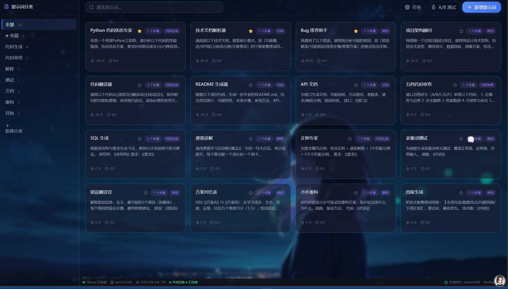
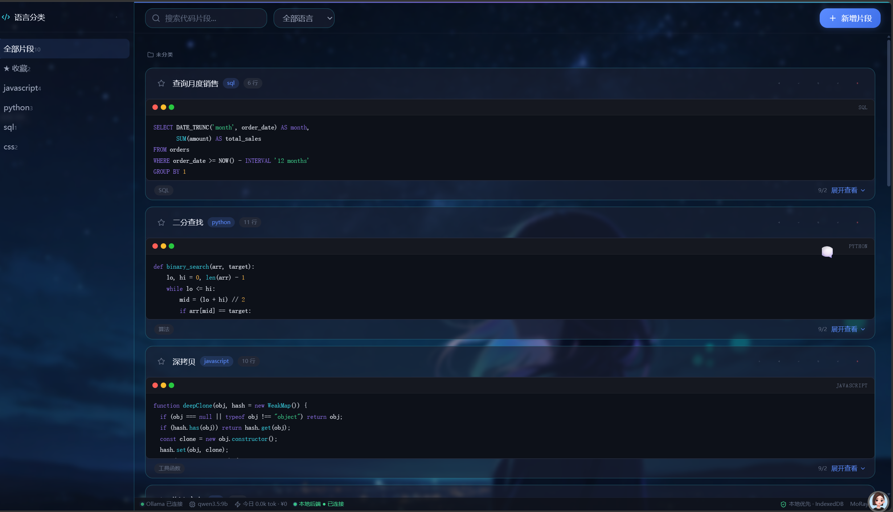
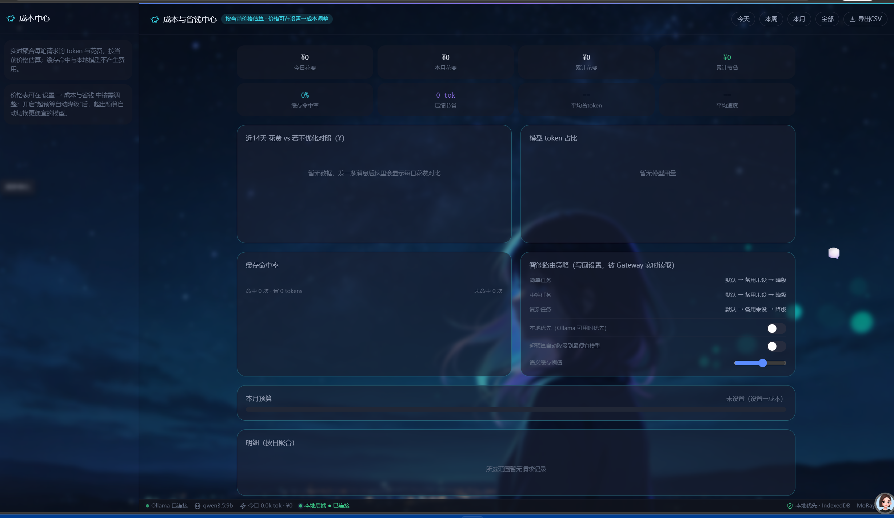
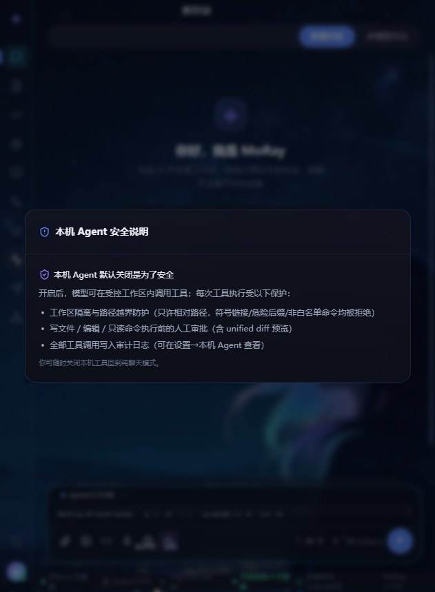
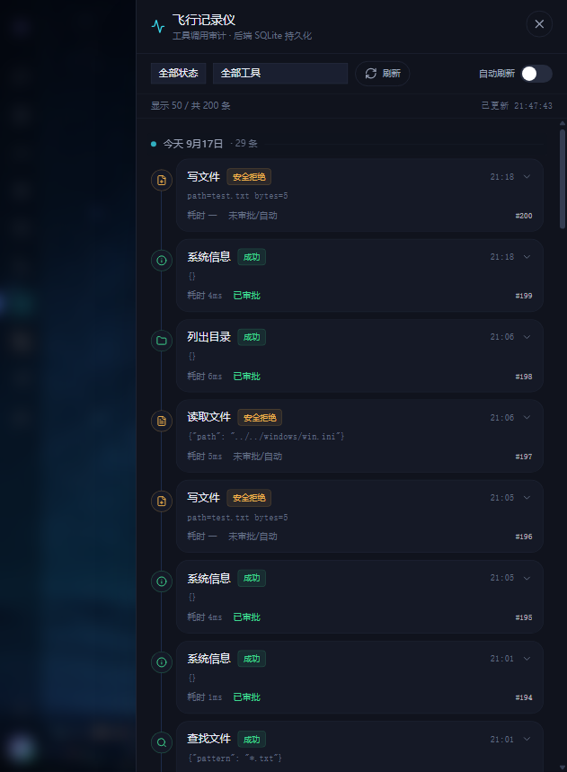

# MoRay · 本地优先的 AI 开发者工作台

> **让 AI Agent 在你的电脑上安全地干活——数据不出本机、操作可回放、能力可被外部调用。**
> 一份产物、两种用法：双击即用的纯前端单文件，或 FastAPI + SQLite 的本地全栈应用；兼容 **Ollama 本地模型**与任意 **OpenAI 兼容云端**（DeepSeek 等）。

<p align="left">
  <b>🌐 在线体验（BYOK）：</b><a href="https://moray1.pages.dev">moray1.pages.dev</a>
  &nbsp;｜&nbsp; <b>💻 本地使用：</b>双击 <code>moray-workbench.html</code>
  &nbsp;｜&nbsp; <b>📦 许可证：</b>MIT
  &nbsp;｜&nbsp; <b>🔌 MCP：</b><code>http://127.0.0.1:8000/api/mcp/sse</code>
</p>

---

## 🔥 三大核心亮点

### 🔒 七层路径防护 + 本地安全 Agent

MoRay 的本机 Agent 运行在**受控工作区**（默认 `D:\MoRayWorkspace`）内，七层路径防护层层把关：工作区根锁定、符号链接逃逸拦截、危险后缀拒绝、命令白名单、副作用人工审批（unified diff）、全量审计落库、Windows 保留设备名拦截。AI 碰不到你的系统文件，每一步操作都可追溯。

### ⏪ Event Sourcing 确定性回放

基于事件溯源架构，每次工具调用的完整入参、出参、上下文状态都被序列化为不可变的事件快照。「飞行记录仪」时间轴 UI 可视化展示所有调用，对失败/超时步骤可**修改参数后一键重跑**——安全校验不变，操作链完整可追溯。

### 🔌 标准 MCP Server 兼容

实现了标准的 **MCP（Model Context Protocol）Server**（SSE 传输，零新增依赖），让 Claude Desktop、Cursor、Cherry Studio 等外部 AI 客户端可以安全地调用你的 11 个本机工具。默认只读，副作用工具需显式配置白名单；MCP 调用与前端调用共用同一个安全执行入口，绝不另起一套放宽校验。

---

## 🖼️ 界面预览

**对话工作台**：三栏布局、本地优先、快捷指令与光核输入台


| 提示词库（内置模板 / 变量 / A·B 测试） | 代码片段库（语法高亮 / 沙箱运行） |
|---|---|
|  |  |

| 成本与省钱中心（精确计费 / 预算 / 智能路由策略） | 模型与 API 设置（Ollama / OpenAI 兼容） |
|---|---|
|  |  |

**本机 Agent**：让模型在受控工作区里独立完成多步任务——先列计划、再逐步查找/读取/编辑，写文件与编辑需人工授权并展示 unified diff，全程审计可查

| 计划 → 分步执行（任务计划卡） | 人工审批（unified diff 红绿对比） | 飞行记录仪（时间轴 + 确定性回放） |
|---|---|---|
|  |  |  |

> 以上为本地实机截图，无美化。

---

## 🧰 工作台能力

### 本机 Agent（11 个受控工具）

- **文件操作**：列目录、读文件（UTF-8，默认 64KB 上限）、写文件（自动建目录）、新建文件（绝不覆盖）、移动/重命名（目标已存在拒绝）、精确编辑（old_str 唯一匹配校验，支持 replace_all）
- **搜索与查找**：按文件名通配符递归查找（最多 1000 条）、全文检索（支持正则，最多 200 条命中）
- **系统信息**：查看本机进程列表（按内存排序）、系统概览（OS/CPU/内存/磁盘）
- **只读白名单命令**：`git status/log/diff/branch`、`python/node/npm --version`、`where <名称>`——无 shell、无管道、无重定向，单命令 15 秒超时
- **多步任务编排**：先列计划再逐步执行（任务计划卡实时状态流转，失败自动重试、超限跳过防死循环）
- **人工审批**：write/edit/命令执行前展示 unified diff 预览，Enter 允许 / Esc 拒绝
- **全程审计**：每次工具调用（含被拒绝的）记录时间/参数/审批/状态/耗时，「飞行记录仪」时间轴可回溯
- **确定性回放**：失败/超时步骤可修改参数后一键重跑，事件快照完整可追溯

### 模型与智能路由

- 🧠 同时接入 Ollama 本地模型与任意 OpenAI 兼容云端，界面内切换 / 测试 / 拉取模型
- 🚦 **智能路由按难度分流**：简单任务自动选最小模型省成本，复杂任务自动选最强模型保正确，每条回复标注实际命中模型与路由原因
- 🧯 **失败熔断 + 已驻留亲和**：连续失败的模型短期冷却（半开试探），优先复用已在显存中的模型，避免每句话都反复加载、反复失败
- 🤔 深度思考 **auto / on / off** 三态，思考型模型展示可折叠推理过程
- 🖥️ **多模型对比**：同一问题双模型并排流式输出、真·同步滚动、输入区钉底、可导出对比报告

### 本地优先与隐私

- 🔒 基线存储为浏览器 IndexedDB，**断网 / 无后端也能完整使用**，不白屏、不报错
- 🗄️ 可选 FastAPI + SQLite 后端：在线双写、离线自动回退并标记"待同步"，恢复后一键补传（冲突以较新者为准），支持多窗口 / 同局域网共享
- 🛡️ 选择"本地后端代理"后，云端 Key 只存于 `server/.env`，浏览器请求仅发往 `127.0.0.1`
- 🌐 在线版采用 **BYOK（Bring Your Own Key）**：访客填自己的 Key、只存自己浏览器，部署者不承担任何 token 费用

### 完整工作台闭环

- 📚 **提示词库**：内置模板 / 变量 / A·B 测试 / 分类管理
- 💻 **代码片段库**：语法高亮 / 受限 JS 运行器（Web Worker 隔离 DOM）/ 分类收藏
- 🔄 **自动化工作流**：可视化编排 / 定时触发 / 条件分支
- 📖 **知识库 RAG**：本地文档向量化检索 / 引用来源标注 / 向量缓存
- 💰 **成本中心**：基于服务端 `usage` **精确计费**（而非按字数估算）、预算阈值、触顶自动降级、CSV 导出、自定义价格表
- 🎨 **自定义壁纸**：内置多款壁纸 / 支持自定义上传 / 主题联动
- ⌘K **命令面板**、深浅主题、PWA 可安装离线运行、1280/1024/768/390 响应式适配

> **能力边界（如实声明）**：内置代码运行器基于 Web Worker，只隔离 DOM、并非完整安全沙箱；本地嵌入向量因体积较大按需联网加载。不夸大离线与安全边界。

---

## 🏗️ 技术架构

```
┌──────────────────────────────────────────────────────────┐
│  浏览器：moray-workbench.html（单文件，零 CDN）              │
│  · 纯前端模式：IndexedDB 存储，Ollama / 云端直连           │
│  · 后端模式：经 http://127.0.0.1:8000 访问                │
└───────────────┬──────────────────────────┬───────────────┘
                │ /api/*（同步 / 代理 / 工具） │ file:// 直开（无后端）
┌───────────────▼──────────────────────────▼───────────────┐
│  server/  FastAPI 薄后端（仅监听 127.0.0.1）                │
│  · /api/health 健康检查      · /api/llm/chat 云端代理透传   │
│  · conversations/messages/settings/kv 的 SQLite CRUD      │
│  · /api/agent/*  本机 Agent：七层安全层 + 11 工具 + 审批    │
│  · /api/agent/replay  确定性回放：事件快照 + 修改重跑        │
│  · /api/mcp/sse  MCP Server：SSE + JSON-RPC 2.0           │
│  · agent_tool_log / event_snapshots  审计 + 事件溯源        │
└───────────────┬──────────────────────────┬───────────────┘
                │                          │
       SQLite（server/data）         工作区（D:\MoRayWorkspace）
        + Ollama（本机 11434）       + 云端 LLM（Key 在 .env）
```

## 技术栈

| 层 | 选型 |
|---|---|
| 前端 | 原生 JavaScript（21 分片组装为单文件）、Tailwind 风格 CSS、Lucide 图标、marked / DOMPurify / highlight（全部本地化，零 CDN） |
| 前端存储 | IndexedDB（本地优先，含禁用时的内存降级） |
| 后端 | FastAPI + Uvicorn（Python 3.12/3.13），标准库 sqlite3 参数化查询、无 ORM |
| MCP | 原生 SSE + JSON-RPC 2.0（零新增依赖，不引入官方 mcp SDK） |
| 模型接入 | Ollama（`/api/chat` 与 OpenAI 兼容口）+ 任意 OpenAI 兼容云端，SSE 流式 |
| 工程化 | 分片幂等组装、四份产物哈希一致性校验、PWA（sw.js + manifest）、静态 / 全栈 / 桌面多形态 |

---

## 💡 关键设计决策

### 1. 双存储 + 离线降级

以 IndexedDB 为不可缺的基线，后端在线时双写 SQLite；后端不可达自动回退本地并标记，恢复后按"较新者胜"补同步，保证任何网络状态下都不丢数据、不阻塞输入。

### 2. 一份产物、两种部署

`parts/` 21 个分片经 `assemble.py` **幂等**拼装为单文件前端；同一文件既能 `file://` 双击直开，也能被 FastAPI 同源托管，静态站与本地全栈共用一份构建产物。

### 3. 智能路由与容错

复杂度分级选模；为失败模型设计短期熔断与半开试探，结合 Ollama `/api/ps` 偏好已驻留模型；用户手动选定的模型不会被自动路由覆盖。

### 4. 成本精确可控

优先采用服务端返回的 `usage.completion_tokens` 精确计量，叠加精确 / 语义缓存与预算触顶自动降级，把"本地免费、云端省钱"落到数字上。

### 5. 安全与诚实

SQL 全部参数化（无 ORM）、CORS 用精确正则同时放行 `file://` 与本机端口（避免 `* + credentials` 错误组合）、Key 只落 `.env`，并对沙箱 / 离线能力做不夸大的边界说明。

### 6. MCP 安全同源

MCP 调用与前端调用共用同一个执行入口（`_execute_tool_internal`），七层路径防护、审批逻辑、审计日志完全一致。外部客户端不会因为"走了另一条路"而获得更宽松的权限。默认状态下外部客户端只能调用 6 个只读工具；5 个副作用工具需要显式配置白名单才能放行。

---

## 🚀 快速开始

### Windows 一键全栈（推荐 · 完整能力）

1. 安装 [Python 3.12/3.13](https://www.python.org/downloads/)（安装时勾选 *Add to PATH*）
2. 安装 [Ollama](https://ollama.com) 并拉取一个模型（本机 Agent 需要模型支持工具调用，见下方建议）
3. 双击 **`启动MoRay.bat`**：自动建虚拟环境 → 装依赖 → 起后端 → 打开浏览器
   - 首次 1–3 分钟（官方源慢会自动回退阿里云镜像），之后秒开
   - 换端口：`set MORAY_PORT=8123` 再启动

> ⚠️ **能力边界**：**本机 Agent（工作区工具）只在一键全栈 / 本地运行时可用**——它需要本地后端的安全层执行文件操作。纯前端打开与在线部署版（BYOK）不携带本机 Agent 能力，其余对话 / 对比 / 路由 / 成本等功能不受影响。

### macOS / Linux

```bash
chmod +x start_moray.sh
./start_moray.sh                   # 默认 8000
MORAY_PORT=8123 ./start_moray.sh   # 换端口
```

### 纯前端免后端

直接双击 `moray-workbench.html`（数据存 IndexedDB）。本地 Ollama 对话、云端直连、智能路由、思考三态、多模型对比、成本统计均可用；SQLite 同步、"Key 不进浏览器"的后端代理与本机 Agent 需要一键全栈。

### Agent 模型建议（工具调用真机实测）

| 模型 | 非流式 | 流式 | 结论 |
|---|---|---|---|
| **qwen2.5:7b** | 3/3 | 3/3 | ✅ 最稳，Agent 任务首选 |
| qwen3.5:9b / 4b | 2/3 | 3/3·2/3 | ⚠️ 基本可用，偶发漏调 |
| qwen2.5:1.5b | 2/3 | 1/3 | ❌ 不可靠 |

使用前可点顶部提示条「自检」一键验证当前模型能否触发工具调用；云端 DeepSeek 的 tools 支持由 OpenAI 兼容协议保证。

### 云端 Key（可选）

复制 `server/.env.example` 为 `server/.env`，填写后重启后端，并在「设置 → 云端 API」选择"经本地后端代理"：

```ini
MORAY_LLM_BASE_URL=https://api.deepseek.com/v1
MORAY_LLM_API_KEY=sk-你的key
MORAY_LLM_MODEL=你的模型名
```

Ollama 本地模型无需任何配置（自动探测 11434）。

### MCP 连接（外部 AI 客户端）

后端启动后，MCP SSE 地址为：

```
http://127.0.0.1:8000/api/mcp/sse
```

在 Claude Desktop / Cursor / Cherry Studio 的 MCP 配置中填入此地址即可。默认只放行 6 个只读工具；如需授权写操作，设置环境变量 `MORAY_MCP_ALLOWED_TOOLS=read_file,write_file,create_file` 后重启后端。

---

## 🌐 在线部署（BYOK，零服务器成本）

`python assemble.py --web` 生成的 `web/` 是纯静态站，可直接拖拽部署到 **Cloudflare Pages / Vercel / Netlify / GitHub Pages**，无需构建配置。

> **线上演示版边界（如实声明）**：`--web` 导出的成品为纯前端 BYOK，**不含本机 Agent 能力**（受控工作区工具需要本地后端安全层执行）。

---

## 📁 目录结构

```
MoRay/
├── moray-workbench.html   # 单文件前端（双击即用，构建产物）
├── 启动MoRay.bat / start_moray.sh   # 一键启动（Win / mac·Linux）
├── assemble.py            # 前端构建：parts/ 分片 → 单文件（幂等）
├── parts/                 # 前端源码：21 个功能分片
├── vendor/                # 运行依赖本地化（tailwind/marked/highlight/lucide…，零 CDN）
├── wallpapers/            # 内置壁纸
├── scripts/               # 一键启动、发布构建、e2e/安全/截图校验脚本
├── server/                # FastAPI + SQLite 薄后端（app/、requirements、.env.example）
│   └── app/
│       ├── main.py        # FastAPI 入口 + 路由挂载
│       ├── agent_tools.py # 本机 Agent：七层安全层 + 11 工具 + 审批 + 回放
│       ├── mcp_server.py  # MCP Server：SSE + JSON-RPC 2.0
│       ├── crud.py        # SQLite CRUD（含事件快照）
│       ├── db.py          # 数据库建表（含 event_snapshots）
│       └── config.py      # 配置（含 MCP 白名单）
├── docs/                  # 文档（技术白皮书等）
├── deploy/                # 在线版 Cloudflare Worker 跨域代理（可选）
├── web/                   # assemble --web 导出的静态部署目录
├── src-tauri/             # 桌面安装包壳（规划 / 进行中）
└── design-preview/        # 开场动效设计选型稿
```

---

## 🛠️ 开发与构建

```bash
python assemble.py                 # parts/ → moray-workbench.html（幂等）
python assemble.py --web web       # 导出可部署的纯静态目录 web/
python scripts/build_release.py    # 生成干净发布包 release/（自动排除密钥/数据/备份）
```

`scripts/` 下另含重复 id 扫描、未闭合标签 / 括号平衡、布局与产物哈希校验等自检脚本。

---

## 🗺️ 路线图

**已完成**
- [x] 本地薄后端（FastAPI + SQLite，双存储离线降级、一键全栈启动）
- [x] 本机 Agent（受控工作区 · 11 工具 · 计划→分步执行 · unified diff 审批 · 全程审计 · 常驻文件树）
- [x] Event Sourcing 确定性回放（事件快照表 + 飞行记录仪时间轴 + 修改重跑）
- [x] MCP 协议兼容层（SSE 传输 + 11 工具暴露 + 默认只读白名单 + 安全同源）
- [x] 多模型对比（并排流式、同步滚动、对比报告）
- [x] 智能路由与成本中心（难度分流、熔断亲和、精确计费、预算降级）
- [x] PWA 可安装离线运行
- [x] 在线 BYOK 部署（web/ 静态站 + Cloudflare Worker 透传）

**规划中**
- [ ] WASM/WASI 安全沙箱（代码运行器完整隔离）
- [ ] 定时工作流的后端调度；图片附件 DataURL 入 SQLite 同步
- [ ] Tauri / 免 Python 的 Windows 便携安装包
- [ ] 可选多用户与加密云同步（需自托管）

---

## ❓ 常见问题

- **端口被占用**：`set MORAY_PORT=8123` 后重启，页面用 `moray-workbench.html?backend=8123` 指定。
- **Ollama 未连接**：启动 Ollama 并拉取模型，模型下拉点刷新。
- **云端 401 / 欠费 / 429**：检查 `server/.env` 的 Key 与余额，错误以中文提示且不会回显 Key。
- **PWA 缓存旧版**：Ctrl+Shift+R 硬刷新，或直接访问后端同源地址 `http://127.0.0.1:8000/`。
- **MCP 客户端连不上**：确认后端已启动（`启动MoRay.bat`），SSE 地址为 `http://127.0.0.1:8000/api/mcp/sse`；浏览器访问该地址应看到 `event: endpoint` 流式输出。

---

## 📄 License

[MIT](LICENSE)。本项目仅为客户端 / 本地工具，不内置模型、不提供 API 额度；各自接入的第三方模型与服务条款归对应厂商所有。
