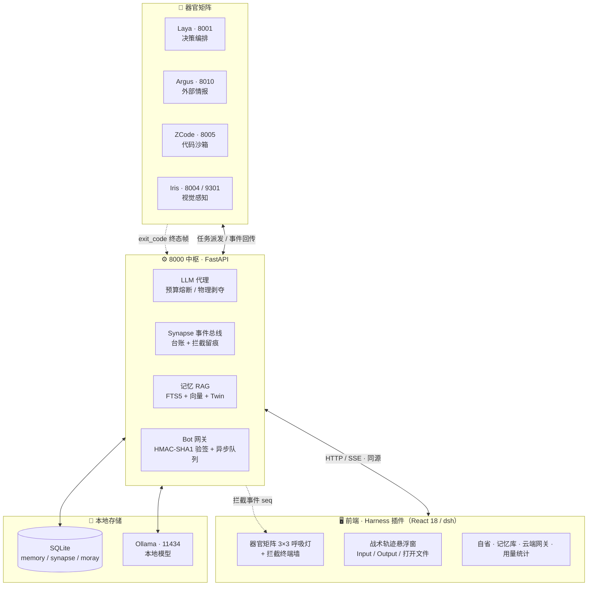

<div align="center">

# 🐟 MoRay

**Mo（克制）+ Ray（光）**

### 本地优先、会自省、全链路可观测的 AI Agent 工作台

> 让 Agent 在你自己的机器上干活——
> **每一次工具调用都看得见，每一次失败都有判据，每一次拦截都留痕。**

[](LICENSE)
[](https://www.python.org/)
[](https://fastapi.tiangolo.com/)
[](https://react.dev/)
[](https://www.electronjs.org/)
[]()
[]()

**快速跳转：[核心亮点](#-核心亮点-the-killer-features) · [架构](#️-架构) · [快速开始](#-快速开始) · [视觉展示](#-视觉展示) · [安全与承诺](#️-安全与承诺)**

</div>

---

## 🌟 一句话

大多数 Agent 是「你问，它答，然后你祈祷它真的做了」。

MoRay 把三件事做成了**物理事实**：

| 问题 | 大多数 Agent | MoRay |
|---|---|---|
| 它到底做了什么？ | 一段自然语言总结 | **工具级 Input / Output 轨迹，可直达源文件** |
| 它成功了吗？ | 模型自己说「已完成」 | **真实 `exit_code` 判据，模型无权定义成功** |
| 它知道自己失败了吗？ | 不知道，或忘记 | **`mental_score` 随失败下降，写进自我叙事** |

---

## 🔥 核心亮点（The Killer Features）

### 1. 👁️ 上帝视角的 Agent 追踪

悬浮在输入台上方的**战术轨迹**（`shell.overlay` 槽位，不遮挡输入台）：

- 每一次工具调用实时上轴——**工具名、成败、耗时、入参、返回值**
- 点开即见 `INPUT` / `OUTPUT` 代码块，JSON 自动着色（键青 / 字符串绿 / 数字琥珀）
- 一键复制原文；**`📂 打开文件`** 直达系统编辑器（走 Harness 原生 `session.openWorkspacePath`，Host 侧校验路径后才交给桌面）
- 采集在 **Host 进程**（`tools/pre-execute` + `tools/result` 钩子），浏览器侧永远拿不到的执行细节，这里拿得到
- 入参 500 / 返回 600 字符截断后入环形缓冲——**观测旁路绝不反噬主链路**

> 不是「日志里翻」，是「看着它做」。

### 2. ⚖️ 拒绝自欺的验证闭环

- ZCode 沙箱的终态**由服务端合成真实 `proc.returncode`**（`zcode.exit_code` 帧），不依赖模型自述
- 前端与看板按 **exit code** 判成败：`0` 才是成功，非零即失败，**缺值置 `None` 而不是回退成 0**
- 自驱任务卡带「预测 / 断言 / 验证命令」三件套，跑完由**外部命令判真伪**——「预测成立 / 预测被证伪 / 命令不可判」三态落库
- 引擎说成了但判据失败？卡片上明写「以判据为准」

> **模型可以幻觉，退出码不会。**

### 3. 🫀 赛博生理学（自省与痛觉）

- `mental_score`（0–100）随真实事件流动：**成功 +5 / 失败 −10**，连续失败单独计数
- 自我叙事每天生成，内容只从记忆库统计里读——**不编造、不美化**
- 30 分钟一轮自省循环：探活 7 个器官、读预算闸、扫 ERROR、统计未闭合链
- 自驱目标在无人时也持续生成，但**写盘/改代码永远需要人点批准**

> 「我做了什么」不是比喻，是从自己的流水里读出来的。

<details>
<summary>点击展开：自省层的四级边界（为什么它只记录、不行动）</summary>

桥一 / 桥二 / 桥三严格守住**级别边界**：

- **1 级 · 记录**：发现异常写日志 ✅
- **2 级 · 标记**：标「这里需要关注」 ✅
- **3 级 · 建议**：给出「应该改 X」 ⚠️ 未做
- **4 级 · 执行**：自己改 ❌ 深水区，不做

**「可逆的、参数级的 → 可以自动；不可逆的、代码级的 → 必须问人。」**

**这不是能力问题，是责任问题。**

</details>

### 4. 🪶 极致的静默体验

- Electron 壳 `whenReady` 先探活 8000、必要时 `windowsHide` 拉起后端，**不弹黑框**
- 双击桌面图标 → 静默拉起全量后端 → 抓到 token → 直接进 Harness，**全程零终端窗口**
- 关闭窗口按托盘策略收尾，不留孤儿进程（看门狗 3s 心跳）

<details>
<summary>点击展开：七大关键设计决策（工程取舍全记录）</summary>

以下七条来自 v3.x 的工程实践，至今仍是代码里能被验证的约束。

**1. 双存储 + 离线降级**

以 IndexedDB 为不可或缺的基线，后端在线时双写 SQLite；后端不可达自动回退本地并标记，恢复后按「较新者胜」补同步，保证任何网络状态下都不丢数据、不阻塞输入。

**2. 一份产物、两种部署**

`parts/` 分片经 `assemble.py` 幂等拼装为单文件前端；同一文件既能 `file://` 双击直开，也能被 FastAPI 同源托管，静态站与本地全栈共用一份构建产物。

**3. 智能路由与容错**

复杂度分级选模型；为失败模型设计短期熔断与半开试探，结合 Ollama `/api/ps` 偏好已驻留模型；用户手动选定的模型不会被自动路由覆盖。

**4. 成本精确可控**

优先采用服务端返回的 `usage.completion_tokens` 精确计量，叠加精确 / 语义缓存与预算触顶自动降级，把「本地免费、云端省钱」落到数字上。

**5. 安全与诚实**

SQL 全部参数化（无 ORM）、CORS 用精确正则同时放行 `file://` 与本机端口（避免 `*` + `credentials` 错误组合）、Key 只落 `.env`，并对沙箱 / 离线能力做**不夸大**的边界说明。

**6. MCP 安全同源**

MCP 调用与前端调用**共用同一个执行入口**，七层路径防护、审批逻辑、审计日志完全一致。外部客户端不会因为「走了另一条路」而获得更宽松的权限。

**7. 自省只记录、不行动**

桥一 / 桥二 / 桥三只做「记录 + 标记」，不越级到「建议 / 执行」。**可逆的、参数级的可以自动；不可逆的、代码级的必须问人。**

</details>

---

## 🏗️ 架构


```mermaid
flowchart TB
  subgraph FE["🖥️ 前端 · Harness 插件（React 18 / dsh）"]
    F1["器官矩阵 3×3 呼吸灯<br/>+ 拦截终端墙"]
    F2["战术轨迹悬浮窗<br/>Input / Output / 打开文件"]
    F3["自省 · 记忆库 · 云端网关 · 用量统计"]
  end

  subgraph GW["⚙️ 8000 中枢 · FastAPI"]
    G1["LLM 代理<br/>预算熔断 / 物理剥夺"]
    G2["Synapse 事件总线<br/>台账 + 拦截留痕"]
    G3["记忆 RAG<br/>FTS5 + 向量 + Twin"]
    G4["Bot 网关<br/>HMAC-SHA1 验签 + 异步队列"]
  end

  subgraph AG["🤖 器官矩阵"]
    A1["Laya · 8001<br/>决策编排"]
    A2["Argus · 8010<br/>外部情报"]
    A3["ZCode · 8005<br/>代码沙箱"]
    A4["Iris · 8004 / 9301<br/>视觉感知"]
  end

  subgraph MEM["🧠 本地存储"]
    M1[("SQLite<br/>memory / synapse / moray")]
    M2["Ollama · 11434<br/>本地模型"]
  end

  FE <-->|"HTTP / SSE · 同源"| GW
  GW <-->|"任务派发 / 事件回传"| AG
  GW <--> M1
  GW <--> M2
  AG -.->|"exit_code 终态帧"| GW
  GW -.->|"拦截事件 seq"| F1
```

**七器官探活（3 秒一轮真 TCP 探测）**

| 端口 | 器官 | 职责 |
|---|---|---|
| 8000 | 中枢薄后端 | FastAPI 网关：代理 / 记忆 / 预算 / 自省 / Bot |
| 8001 | Laya | 决策与任务编排 |
| 8005 | ZCode | 代码沙箱执行（真实 exit code） |
| 8010 | Argus | 外部情报检索与深度研究 |
| 8004 | Iris（JSON-RPC） | 视觉感知（供 Laya 调用） |
| 9301 | Iris（SSE） | 视觉感知（主服务） |
| 11434 | Ollama | 本地模型推理 |

<details>
<summary>点击展开：MCP 外部接入与工作台能力详情</summary>

### 🔌 MCP Server（SSE + JSON-RPC 2.0，零新增依赖）

后端启动后，MCP SSE 地址为：

```
http://127.0.0.1:8000/api/mcp/sse
```

在 Claude Desktop / Cursor / Cherry Studio 的 MCP 配置中填入此地址即可。

**默认只放行 6 个只读工具**（外部客户端默认只能看，不能改）：

| 工具 | 作用 |
|---|---|
| `list_directory` | 列目录 |
| `read_file` | 读文件（UTF-8，默认 64KB 上限） |
| `find_files` | 按通配符递归查找（最多 1000 条） |
| `search_text` | 全文检索（支持正则，最多 200 条命中） |
| `list_processes` | 进程列表（按内存排序） |
| `system_info` | OS / CPU / 内存 / 磁盘概览 |

如需授权写操作，设置环境变量 `MORAY_MCP_ALLOWED_TOOLS=read_file,write_file,create_file` 后重启后端（运行期还可用 kv 表 `mcp_allowed_tools` 覆盖）。**放行后仍走 `_safe_path` 等全部防护，且与前端调用共用同一个执行入口。**

### 🖥️ 本机 Agent（11 个受控工具）

- **文件操作**：列目录、读文件（UTF-8，默认 64KB 上限）、写文件（自动建目录）、新建文件（绝不覆盖）、移动/重命名（目标已存在拒绝）、精确编辑（`old_str` 唯一匹配校验，支持 `replace_all`）
- **搜索与查找**：按文件名通配符递归查找（最多 1000 条）、全文检索（支持正则，最多 200 条命中）
- **系统信息**：查看本机进程列表（按内存排序）、系统概览（OS/CPU/内存/磁盘）
- **只读白名单命令**：`git status/log/diff/branch`、`python/node/npm --version`、`where <名称>` ——**无 shell、无管道、无重定向，单命令 15 秒超时**
- **多步任务编排**：先列计划再逐步执行（任务计划卡实时状态流转，失败自动重试、超限跳过防死循环）
- **人工审批**：`write/edit/命令`执行前展示 unified diff 预览，Enter 允许 / Esc 拒绝
- **全程审计**：每次工具调用（含被拒绝的）记录时间/参数/审批/状态/耗时，落库可回溯；确定性回放接口保留在后端
- **确定性回放**：失败/超时步骤可修改参数后一键重跑，事件快照完整可追溯

### 🧭 模型与智能路由

- 🐏 同时接入 **Ollama 本地模型**与任意 **OpenAI 兼容云端**，界面内切换 / 测试 / 拉取模型
- 🧭 **智能路由按难度分流**：简单任务自动选最小模型省成本，复杂任务自动选最强模型保正确，每条回复标注实际命中模型与路由原因
- ❄️ **失败熔断 + 已驻留亲和**：连续失败的模型短期冷却（半开试探），优先复用已在显存中的模型，避免每句话都反复加载、反复失败
- 🧠 **深度思考 auto / on / off 三态**，思考型模型展示可折叠推理过程
- ⚖️ **多模型对比**：同一问题双模型并排流式输出，真·同步滚动、输入区钉底、可导出对比报告

### 💾 本地优先与隐私

- 💾 基线存储为浏览器 **IndexedDB**，断网 / 无后端也能完整使用，不白屏、不报错
- 🔄 可选 **FastAPI + SQLite 后端**：在线双写、离线自动回退并标记「待同步」，恢复后一键补传（冲突以较新者为准），支持多窗口 / 同局域网共享
- 🔒 选择「本地后端代理」后，云端 Key 只存于 `server/.env`，浏览器请求仅发往 `127.0.0.1`
- 🌐 在线版采用 **BYOK（Bring Your Own Key）**：访客填自己的 Key、只存自己浏览器，部署者不承担任何 token 费用

### 🧩 完整工作台闭环

- 📝 **提示词库**：内置模板 / 变量 / A·B 测试 / 分类管理
- 💻 **代码片段库**：语法高亮 / 受限 JS 运行器（Web Worker 隔离 DOM）/ 分类收藏
- 🤖 **自动化工作流**：可视化编排 / 定时触发 / 条件分支
- 📚 **知识库 RAG**：本地文档向量化检索 / 引用来源标注 / 向量缓存
- 💰 **成本中心**：基于服务端 usage 精确计费（而非按字数估算）、预算阈值、触顶自动降级、CSV 导出、自定义价格表
- 🎨 **自定义壁纸**：内置多款壁纸 / 支持自定义上传 / 主题联动
- ⌨️ **命令面板、深浅主题、PWA 可安装离线运行**、`1280/1024/768/390` 响应式适配

> **能力边界（如实声明）**：内置代码运行器基于 Web Worker，只隔离 DOM、并非完整安全沙箱；本地嵌入向量因体积较大按需联网加载。**不夸大离线和安全边界。**

</details>

---

## 🚀 快速开始

### 环境准备

| 依赖 | 版本 | 说明 |
|---|---|---|
| Windows | 10 / 11 | 当前主力平台（PowerShell / 批处理脚本） |
| Python | **3.10+**（推荐 3.12） | 后端与脚本 |
| Node.js | 18+（推荐 20+） | 桌面壳 / Harness 前端 |
| Ollama | 最新 | 本地模型（全部使用云端模型时可缺省） |

### 一键启动（推荐）

```bat
:: 1) 后端：自动建 venv、装依赖、起 8000、打开浏览器
双击  启动MoRay.bat

:: 2) 桌面端（可选）：静默拉起后端 + Harness，无黑框
双击  electron-app\MoRay.lnk
```

### 手动启动（调试用）

```bat
:: 后端
server\.venv\Scripts\python.exe -m uvicorn server.app.main:app --host 127.0.0.1 --port 8000

:: 全部器官（Laya / Argus / ZCode / Iris / Ollama…）
start_all_services.bat
```

### 配置

```bat
copy server\.env.example server\.env
:: 编辑 server/.env，填入你自己的模型地址与 Key（.env 已被 .gitignore 屏蔽）
```

> **Key 永远不会进仓库。** 云端 Key 只写本机 `.env` 或本地 SQLite；前端只向 `127.0.0.1` 发请求。

---

## 📸 视觉展示

### 图 1 · 器官矩阵与拦截终端墙


> 3×3 呼吸灯矩阵真 TCP 探活（延迟实时刷新）；下方终端墙是**真实拦截留痕**——Twin RAG 命中后外部搜索被物理剥夺。

### 图 2 · 战术轨迹展开 Input / Output


> 一次真实 `read` 工具调用：JSON 着色、文件路径直达、每块独立复制。

### 图 3 · 自省心智面板


> `mental_score`、连败计数、559 字自我叙事、自驱目标队列——全部来自本地流水，不经 LLM 美化。

---

## 🛡️ 安全与承诺

| 承诺 | 实现方式（可验证） |
|---|---|
| **数据不出本机** | 记忆 / 会话 / 审计全部落本地 SQLite（`server/data/*.sqlite3`，已被 gitignore） |
| **Key 不进仓库** | `.env` + `*.sqlite` 全量忽略；仓库只留 `.env.example` 模板 |
| **防幻觉拦截** | Twin RAG 强命中时，**从请求体里物理摘除外部搜索工具**——模型不是「被劝住」，是**没有这个工具可调**；预算耗尽时同理熔断，并留下拦截事件 |
| **成功由判据定义** | 代码执行取真实 `exit_code`，模型自述仅作过程记录 |
| **外呼可审计** | Bot 入站 `X-Signature`（HMAC-SHA1，原始 body 验签）**fail-close**：签名错直接 401，不回落其他凭据 |
| **观测只回环** | 轨迹 / 器官路由仅绑 `127.0.0.1`，同源校验后才返回 |

> **能力边界（如实声明）**：当前主力平台是 Windows；前端插件依赖 dsh Harness（`moray-panels` 插件）；本地模型的推理质量取决于你所选的模型；未实现「全自动改系统文件」——写盘/改代码永远需要人点批准。

---

## 🧰 技术栈

**后端** FastAPI · SQLite（FTS5 + sqlite-vec）· httpx · uvicorn
**前端** React 18 · dsh Harness 插件（`shell.overlay` / `main` / `sidebar.panellist` 槽位）· 纯 CSS 呼吸灯与终端墙
**桌面端** Electron 33（无边框沉浸 · 静默拉起 · 托盘策略）
**模型** Ollama（本地）· 任意 OpenAI 兼容云端（自备 Key）

<details>
<summary>点击展开：Agent 模型工具调用真机实测（含踩坑建议）</summary>

**实测于 2026-09，统一同一套文件/搜索工具任务，统计「首轮就正确调用工具」的比例。**

| 模型 | 非流式 | 流式 | 结论 |
|---|---|---|---|
| `qwen2.5:7b` | 3/3 | 3/3 | ✅ 最稳，Agent 任务首选 |
| `qwen3.5:9b` / `4b` | 2/3 | 3/3 · 2/3 | ⚠️ 基本可用，偶发漏调 |
| `qwen2.5:1.5b` | 2/3 | 1/3 | ❌ 不可靠 |

> 💡 **思考型模型提示**：`qwen3.5:9b`、`deepseek-r1` 等在生成前会先输出大段思考，首 token 延迟较长。如果前端「请求超时」设得太短（默认 30s），会看到「已停止生成」。**建议把「请求超时」调到 120s 或更高。**

**选型结论**：工具调用是硬指标——参数量小于 3B 的模型偶尔「会用工具」，但**不能承担 Agent 任务**（漏调 = 任务静默失败）。这也是 MoRay 把「失败必须留痕」做成基础设施的原因。

</details>

---

## 📄 开源协议与致谢

**License: [MIT](LICENSE)** — Copyright (c) 2026 莫光良 (aliangmo2026)

感谢这些项目让「本地优先的 Agent 工作台」成为可能：

- [FastAPI](https://fastapi.tiangolo.com/) / [uvicorn](https://www.uvicorn.org/) — 薄后端底座
- [Ollama](https://ollama.com/) — 本地模型推理
- [DeepSeek Harness (dsh)](https://github.com/deepseek-ai/deepseek-harness) — 可插拔的前端运行时
- [React](https://react.dev/) · [Electron](https://www.electronjs.org/) · [SQLite](https://www.sqlite.org/)

> 如果 MoRay 让你对「Agent 到底做了什么」这件事多了一点把握，欢迎 Star ⭐、提 Issue、或者直接读代码——**每一层都可验证**。
